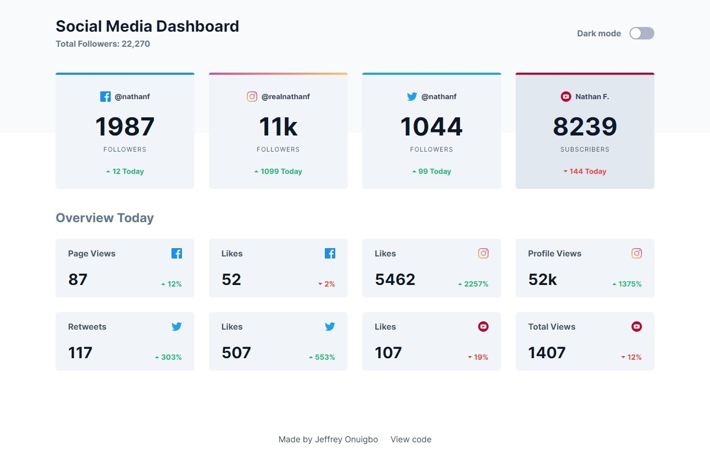

# Frontend Mentor - Social media dashboard with theme switcher solution

This is a solution to the [Social media dashboard with theme switcher challenge on Frontend Mentor](https://www.frontendmentor.io/challenges/social-media-dashboard-with-theme-switcher-6oY8ozp_H). Frontend Mentor challenges help you improve your coding skills by building realistic projects.

## Table of contents

-   [Overview](#overview)
    -   [The challenge](#the-challenge)
    -   [Screenshot](#screenshot)
    -   [Links](#links)
-   [My process](#my-process)
    -   [Built with](#built-with)
    -   [What I learned](#what-i-learned)
    -   [Useful resources](#useful-resources)
-   [Author](#author)

## Overview

### The challenge

Users should be able to:

-   View the optimal layout for the site depending on their device's screen size
-   See hover states for all interactive elements on the page
-   Toggle color theme to their preference

### Screenshot

### Links

-   Solution URL: [GitHub](https://github.com/jeffreyon/social-media-dashboard)
-   Live Site URL: [Deployed on Netlify](https://dash-social.netlify.app/)

## My process

You can read about the process on my blog, here's a link to the article

### Built with

-   Semantic HTML5 markup
-   CSS custom properties
-   Flexbox
-   CSS Grid
-   Mobile-first workflow
-   [React](https://reactjs.org/) - JS library
-   [Tailwind CSS](https://tailwindcss.com) - CSS library

### What I learnt

I learnt some new things this time around and wrote articles for others. Things like:

-   How to add a pre-loading animation to a react app
-   How to animate react components using animate.css
-   How to add gradient borders to elements
-   Using context in React to simplify access to stateful values
-   How to add dark mode to a website using TailwindCSS

## Let's connect

-   [Jeffrey Onuigbo](https://jeffreyon.netlify.app)
-   [Twitter](https://twitter.com/jeffreyon_)
